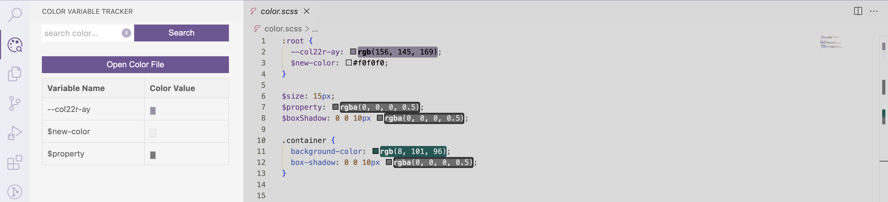
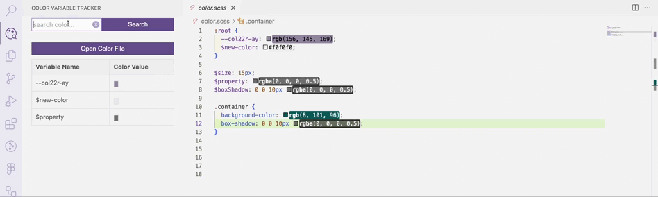
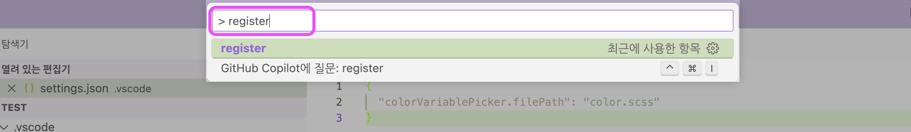

# </a> colorvariabletracker
<p align="center"></a></p>

- **colorvariabletracker**는 특정 SCSS, CSS 파일의 컬러 변수를 추적할 수 있습니다.
- 기능은 컬러 변수 리스트 보기, 변수명이나 컬러값으로 컬러 검색하기, 추적하고 있는 컬러파일 바로가기 입니다.
- 컬러 변수는 변경시 동적으로 리스트가 업데이트됩니다.
- ***colorvariabletracker** can track color variables in specific SCSS and CSS files.*
- *The functions are to view a list of color variables, search for colors by variable name or color value, and shortcut to the color file being tracked.*
- *When color variables change, the list is dynamically updated.*


<br/>


## Features

### 1. 컬러 변수 리스트 보기, **View color variable list**

- vscode 사이드바 영역에서 선언된 컬러 변수를 표 형태로 볼 수 있습니다.
- *You can view the color variables declared in the vscode sidebar area in table form.*

<p align="center"></p>

<br/>

### 2. 검색하기, **Search**

- 변수명 혹은 컬러값으로 선언된 컬러변수 리스트를 볼 수 있습니다.
- *You can see a list of color variables declared by variable name or color value.*

<p align="center"></p>

<br/>

### 3. 파일 바로가기, **Go to file**

- 현재 추적하고 있는 컬러 파일을 열 수 있습니다.
- *You can open the color file you are currently tracking.*

<p align="center"></p>

<br/>

### 4. 동적으로 값 변경 적용, **Apply value changes dynamically**

- 현재 추적하고 있는 컬러값을 수정하면, 리스트에 변경된 값이 반영됩니다.
- *If you modify the color value currently being tracked, the changed value will be reflected in the list.*

<p align="center"></p>

<br/>

### 5. 컬러 복사하기, **Copy color**

- 리스트에서 컬러 변수의 컬러를 클릭으로 바로 복사할 수 있습니다.
- *You can copy the color of the color variable in the list by clicking on it.*

<p align="center"></p>

<br/><br/>

## Extension Settings

- extension을 사용하기 위해, 추적할 컬러 파일의 상대 경로를 지정해야 합니다.
- `.vscode/settings.json` 에서 추적하고 싶은 컬러 파일의 상대 경로를 추가합니다.
- *To use the extension, you must specify the relative path to the color file you want to track.*
- *Add the relative path of the color file you want to track in `.vscode/settings.json`.*

```json
{
  "colorVariablePicker.filePath": "/color.scss"
}
```

<br/>

- 그 다음, vscode의 command palette에서 명령어(`register`)를 입력하면, 사이드바가 업데이트됩니다.
- *Next, when you enter the command (`register`) in vscode's command palette, the sidebar is updated.*

<p align="center"></p>

<br/><br/>


## Release Notes

### 1.0.0
